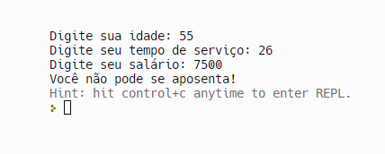
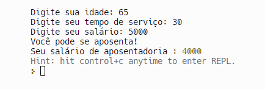
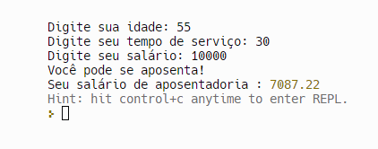
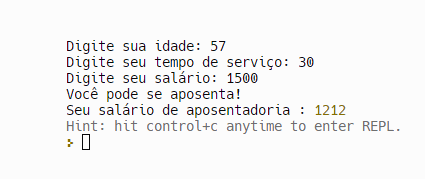

## Instituto Federal do Espírito Santo

# Sandra-F-JavaScript-Pratica-da-Semana-2 
# https://github.com/mjpfelicia

                 Welcome! 👋

## Índice

- Desafio
- Links
- Tecnologias usadas
- O que eu aprendi
- Recursos úteis
- javascript

## Links usados:

- https://developer.mozilla.org/en-US/docs/Web/JavaScript
- https://youtu.be/1bFpiRU7q2g?si=AAGKqC9JsVkAf-oY